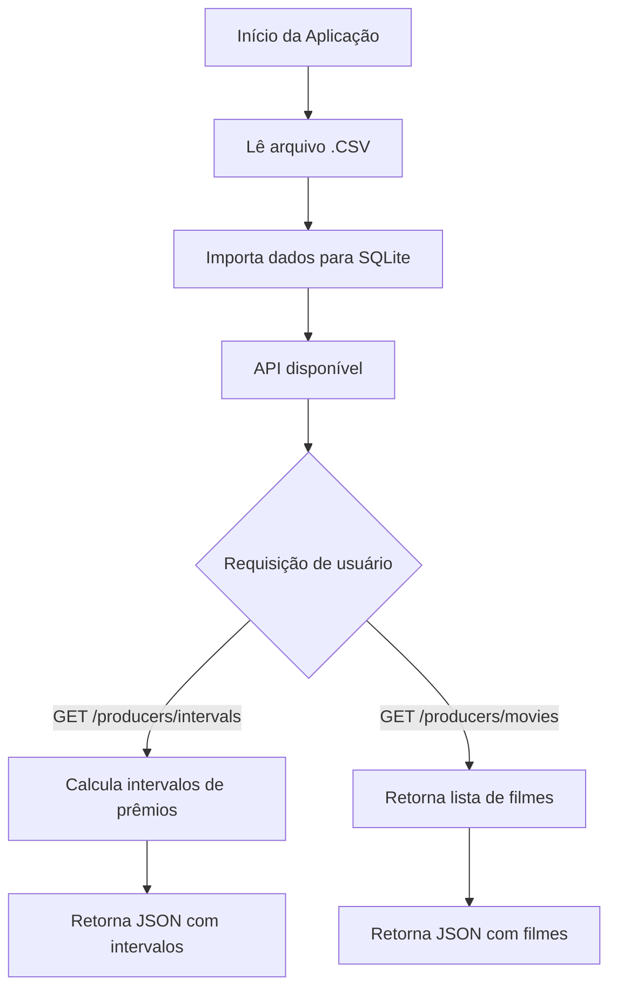

# Golden Raspberry Awards API

Este projeto é uma API RESTful desenvolvida em Node.js utilizando Fastify, Knex e SQLite, para o desafio técnico da empresa Outsera.

## Especificação do Teste
Desenvolva uma API RESTful para possibilitar a leitura da lista de indicados e vencedores da categoria Pior Filme do Golden Raspberry Awards.

### Requisitos do Sistema
1. Ler o arquivo CSV dos filmes e inserir os dados em uma base de dados ao iniciar a aplicação.

### Requisitos da API
1. Obter o produtor com maior intervalo entre dois prêmios consecutivos, e o que obteve dois prêmios mais rápido, seguindo a especificação de formato definida na página 2.

### Requisitos Não Funcionais do Sistema
1. O web service RESTful deve ser implementado com base no nível 2 de maturidade de Richardson.
2. Devem ser implementados somente testes de integração. Eles devem garantir que os dados obtidos estão de acordo com os dados fornecidos na proposta.
3. O banco de dados deve estar em memória utilizando um SGBD embarcado (por exemplo, SQLite). Nenhuma instalação externa deve ser necessária.
4. A aplicação deve conter um README com instruções para rodar o projeto e os testes de integração.
5. O código-fonte deve ser disponibilizado em um repositório git (Github, Gitlab, Bitbucket, etc).

## Funcionalidades
- Importação de dados de produtores e filmes a partir de arquivos CSV
- Rotas para consulta de intervalos de prêmios entre vitórias de produtores
- Estrutura pronta para testes automatizados com Vitest e Supertest

[//]: # (Diagrama Mermaid do fluxo principal da aplicação)


## Tecnologias Utilizadas
- [Node.js](https://nodejs.org/)
- [Fastify](https://www.fastify.io/)
- [Knex.js](http://knexjs.org/)
- [SQLite](https://www.sqlite.org/)
- [csv-parser](https://www.npmjs.com/package/csv-parser)
- [Vitest](https://vitest.dev/)
- [Supertest](https://github.com/visionmedia/supertest)
- [Zod](https://zod.dev/)

## Fluxo Principal da Aplicação



## Como rodar o projeto

1. **Clone o repositório:**
   ```bash
   git clone https://github.com/MarcosHoppee/desafio-nodejs-Outsera.git
   ```

2. **Instale as dependências:**
   ```bash
   npm install
   ```

3. **Configure o ambiente:**
   - Adicione o arquivo base .csv dos filmes na pasta `/resources/` para subir os dados no banco em memória.

4. **O arquivo deve seguir o seguinte formato:**
   ```csv
   year;title;studios;producers;winner
   1980;Can't Stop the Music;Associated Film Distribution;Allan Carr;yes
   1980;Cruising;Lorimar Productions, United Artists;Jerry Weintraub;
   1980;The Formula;MGM, United Artists;Steve Shagan;
   ```

5. **Inicie a aplicação:**
   ```bash
   npm run start
   ```

## Endpoints principais

- `GET /producers/intervals` — Retorna os produtores com maior e menor intervalo entre vitórias.
- `GET /producers/movies` — Retorna todos os filmes cadastrados (extra).

## Testes

Execute os testes automatizados com:
```bash
npm run test
```

## Estrutura de pastas
- `src/` — Código-fonte da aplicação
- `src/database/` — Configuração do banco e migrations
- `src/services/` — Serviços de importação e lógica de negócio
- `src/routes/` — Rotas da API
- `test/` — Testes automatizados
- `resources/` — Pasta onde serão importados os arquivos

## Observações
- O projeto utiliza Knex para manipulação do banco de dados e migrations.
- O arquivo CSV de importação deve estar no formato esperado pelo serviço.
- O endpoint `/producers/intervals` retorna os produtores com os menores e maiores intervalos entre vitórias, conforme o desafio proposto.


